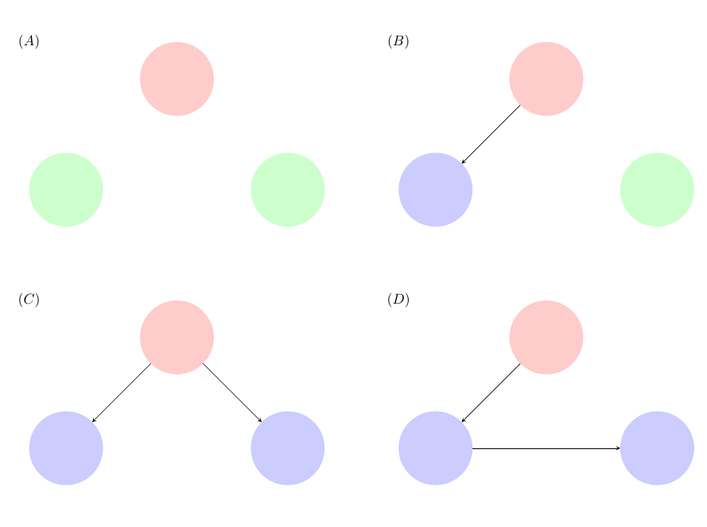

# Statistics Taster Session {#stats_taster}

## Introduction {#sec_intro}

This statistics taster session provides a brief introduction to the concept of maximum likelihood estimation. This introduction is motivated by the [Reed-Frost](https://en.wikipedia.org/wiki/Reed%E2%80%93Frost_model) epidemic model and is applied to household data collected from measles outbreak in Providence, Rhode Island between 1929-1934, see 
[Wilson *et al.* (1939)](https://www.jstor.org/stable/984949#metadata_info_tab_contents) (also 
Bailey (1975), pages 249-254). We describe how the Reed-Frost model is defined in terms of the probability $p$ that an individual, whilst infectious, will infect a susceptible individual they live with. We explore how to choose $p$ given the data in a principled manner, and in particular, to use [Maximum Likelihood Estimation](#sec_like) to find the value of $p$ which maximises the probability of the observed data occurring. We discuss briefly the concept of [goodness-of-fit](#sec_GoF) and the question does the Reed-Frost model provide a good fit to the data? The mathematical concepts introduced in this session are explored further in the Foundations of Statistics module in the [MSc in Statistical Science (Distance Learning)](https://www.nottingham.ac.uk/pgstudy/course/taught/statistical-science-distance-learning-msc). 


## Reed-Frost Model {#sec_ReedFrost}

The Reed-Frost model makes the following assumptions for the spread of the disease through a community.  

The Reed-Frost model is an example of an $SIR$ epidemic model. That is, 
individuals are assumed to be in one of three states:  

- <span style="color: rgba(15, 0, 207, 1);">**Susceptible**</span> - susceptible to being infected with the disease.  
- <span style="color: rgba(207, 0, 15, 1);">**Infective**</span> - infected with the disease and are able to infect susceptible individuals.  
- **Removed** - individuals who are no longer infectious, for example, recovered or dead, and who cannot be reinfected.  

The only transitions in state in an $SIR$ epidemic model are:  
<center>
\[ \mbox{Susceptible} \longrightarrow \mbox{Infective} \]
</center>
and
<center>
\[ \mbox{Infective} \longrightarrow \mbox{Removed}. \]
</center>

The Reed-Frost model models the spread of the disease on a discrete time basis with each individual infectious for one time unit only. The time units are sometimes referred to as generations since an individual infectious at time $t$ (generation $t$) will have been infected by an individual infectious at time $t-1$ (generation $t-1$). It is assumed that each infectious individual has probability $p$ of making an infectious contact with a given susceptible, and the number of individuals an infectious individual makes contact with in a group of $s$ susceptibles follows a Binomial distribution with parameters $s$ and $p$ (${\rm Bin} (s,p)$). That is, if $s=2$, there are 2 susceptible individuals the probability an infective makes infectious contact with only one of the two susceptible individuals is 
<center>
\[2 p (1-p). \]
</center>

### Households of size 3 {-}

We illustrate how the Reed-Frost model works in households of size 3. Suppose that we have <span style="color: rgba(207, 0, 15, 1);">one initial infective</span> and <span style="color: rgba(15, 0, 207, 1);">two initial susceptibles</span>. The initial individual can infect 0, 1 or 2 of the initial susceptibles and these occur with probabilities $(1-p)^2$, $2 p (1-p)$ and $p^2$, respectively. In the event that the initial infective infects one of the susceptibles after one time unit we have a situation where there is one infective, one susceptible and one removed individual in the household. There is then probability $p$ that the infective will infect the remaining susceptible and probability $1-p$ that the susceptible will avoid infection. 

The four possible outcomes for a disease outbreak in a household of size 3 and these are presented in Figure \@ref(fig:RFoutcome). The red individual denotes the initial infective, the green individuals denote those individuals who remain susceptible throughout the outbreak and the blue individuals are those individuals who start susceptible but become infected in the epidemic.

```{r RFoutcome, echo = FALSE, message=FALSE, fig.keep='all', out.width= "80%", fig.cap = " Possible outcomes in a household of size 3."}

```

A summary of the four possible outcomes and the probability of each outcome is given in the table below.


  Outcome  No. infected    Probability 
  -------- -------------- -------------
   A             1         $(1-p)^2$   
   B             2         $2p(1-p)^2$ 
   C             3         $p^2$ 
   D             3         $2p^2(1-p)$       

  
We note that both outcomes $C$ and $D$ lead to all 3 individuals being infected. Therefore if we cannot distinguish between the ways in which the epidemic takes place in a household but only classify an outbreak by its final size, the total number infected, we have that:  

 Final Size   Probability 
 ----------- -------------
    1         $(1-p)^2$   
    2         $2p(1-p)^2$ 
    3         $p^2(3-2p)$ 
    
For example, if $p=0.4$, there is probability $0.6^2 = 0.36$ that the initial infective does not infect either remaining susceptible and the final size of the epidemic is 1. There is probability $2 (0.4) 0.6^2 = 0.288$ that the final size of the epidemic is 2. That is, the initial infective infects one of the initial susceptibles who in turn fails to infect the third person in the household. Finally, there is probability $0.4^2 (3-2\times 0.4) =  0.352$ that all 3 individuals in the household are infected. 

## Data {#sec_data}

We apply the Reed-Frost model to the measles outbreaks in Providence, Rhode Island. The data were first reported in [Wilson *et al.* (1939)](https://www.jstor.org/stable/984949#metadata_info_tab_contents) and investigated further in Bailey (1975). The data we consider here are measles outbreaks in 334 households of size 3. 


 Final Size   Observed 
 ----------- ---------
    1            34   
    2            25
    3           275 
    
## Likelihood {#sec_like}

<span style="color: rgba(15, 0, 207, 1);">**What is the probability (likelihood) that we observe the Providence data under the assumption of the Reed-Frost model?**</span>   
This is an example of a [multinomial distribution](#def:multinomial).

::: {.def #def:multinomial}
<span style="color: rgba(207, 0, 15, 1);">**Multinomial Distribution**</span>  
Suppose that there are $K$ possible mutually exclusive outcomes for an experiment. For $i=1,2,\ldots,K$, let $q_i$ denote the probability that outcome $i$ occurs with $\sum_{i=1}^K q_i = 1$.

Suppose that $n$ independent replicates of the experiment are performed. For $i=1,2,\ldots,K$, let $n_i$ denote the number of occurrences of outcome $i$ with $\sum_{i=1}^K n_i = n$. 

Then the probability of observing $\mathbf{n} =(n_1, n_2, \ldots, n_K)$ is:
<center>
\[ \frac{n!}{n_1! n_2! \ldots n_K!} q_1^{n_1} q_2^{n_2} \ldots q_K^{n_K}.\]
</center>

Note that the special case $K=2$ corresponds to the binomial distribution. 
:::

For an epidemic outbreak in a household of size 3, we have $K=3$ possible outcomes corresponding to epidemics of final size 1, 2 and 3 with probabilities $q_1 = (1-p)^2$, $q_2 = 2p(1-p)^2$ and $q_3 = p^2 (3-2p)$, respectively. Note the probabilities $q_1$, $q_2$ and $q_3$ are all functions of the probability $p$ of an infective infecting a susceptible. 

Thus the likelihood of observing the data $\mathbf{n} = (n_1, n_2, n_3) = (34,25,275)$ as a function of the infection probability $p$, which we denote $L (p; \mathbf{n})$ is given by
<center>
\begin{eqnarray*}
L(p; \mathbf{n}) &=& \frac{n!}{n_1! n_2! n_3!} \left[ (1-p)^2 \right]^{n_1} \left[ 2 p (1-p)^2 \right]^{n_2} \left[ p^2(3- 2p) \right]^{n_3} \\
&=& \frac{n!}{n_1! n_2! n_3!} 2^{n_2} p^{n_2 + 2 n_3} (1-p)^{2(n_1 + n_2)} (3-2p)^{n_3} \\
&=& 2.5037 \times 10^{90} p^{575} (1-p)^{118} (3-2p)^{275}.
\end{eqnarray*}
</center>

<span style="color: rgba(15, 0, 207, 1);">**What value of $p$ maximises $L(p; \mathbf{n})$?**</span>  

By plotting $L(p; \mathbf{n})$ as a function of $p$ in Figure \@ref(fig:RFlike) we observe that $L(p;\mathbf{n})$ obtains its maximum at a value of $p$ close to 0.7. We can find $\hat{p}$ which maximises the likelihood by solving
\[ \frac{d \;}{dp}L(p; \mathbf{n})=0. \]

```{r RFlike, echo = FALSE, message=FALSE, fig.keep='all', out.width= "80%", fig.cap = "Likelihood for the Providence data."}
n=c(34,25,275)
LogA=lfactorial(sum(n))-sum(lfactorial(n))+n[2]*log(2)
p=seq(0.01,0.99,0.001)
lp=(n[2]+2*n[3])*log(p)+(2*(n[1]+n[2]))*log(1-p)+n[3]*log(3-2*p)
lp=LogA+lp
plot(p,exp(lp),type="l",xlab="p",ylab="Likelihood")
```

It is however easier to work with $\ell (p; \mathbf{n}) = \log L (p; \mathbf{n})$, the log-likelihood, and find the value of $p$ which maximises $\ell (p; \mathbf{n})$. The reasons for using the log-likelihood include:  

1. Log(arithm) is an increasing function such that $0< x <y$ if and only if $\log (x) < \log (y)$. Therefore the value of $p$ which maximises the log-likelihood will also maximise the likelihood.  
2. It is usually easier to differentiate the log-likelihood than the likelihood making it <span style="color: rgba(15, 0, 207, 1);">**mathematically**</span> preferable.  
3. The log-likelihood is more numerically stable than the likelihood making it <span style="color: rgba(15, 0, 207, 1);">**computationally**</span> preferable.  

In Figure \@ref(fig:RFloglike), we plot the log-likelihood $\ell (p; \mathbf{n})$ for the Providence data set for $p$ on the range $0.4 < p < 0.99$. We observe that  $\ell (p; \mathbf{n})$ obtains its maximum for $p$ close to 0.7.

```{r RFloglike, echo = FALSE, message=FALSE, fig.keep='all', out.width= "80%", fig.cap = "Likelihood for the Providence data."}
n=c(34,25,275)
LogA=lfactorial(sum(n))-sum(lfactorial(n))+n[2]*log(2)
p=seq(0.4,0.99,0.001)
lp=(n[2]+2*n[3])*log(p)+(2*(n[1]+n[2]))*log(1-p)+n[3]*log(3-2*p)
lp=LogA+lp
plot(p,lp,type="l",xlab="p",ylab="log-likelihood")
```

A numerical optimisation method, such as the [Golden Section Method](https://en.wikipedia.org/wiki/Golden-section_search), can be used to find $\hat{p}$ but we outline how to obtain $\hat{p}$ algebraically.

Watch [Video](#video) for a derivation of the maximum likelihood estimator of $p$.

:::{.des #video}
<span style="color: rgba(207, 0, 15, 1);">**Video: Derivation of $\hat{p}$.**</span>  

<iframe id="kaltura_player" src="https://cdnapisec.kaltura.com/p/1355621/sp/135562100/embedIframeJs/uiconf_id/13188771/partner_id/1355621?iframeembed=true&playerId=kaltura_player&entry_id=1_wlibs6f1&flashvars[streamerType]=auto&amp;flashvars[localizationCode]=en&amp;flashvars[leadWithHTML5]=true&amp;flashvars[sideBarContainer.plugin]=true&amp;flashvars[sideBarContainer.position]=left&amp;flashvars[sideBarContainer.clickToClose]=true&amp;flashvars[chapters.plugin]=true&amp;flashvars[chapters.layout]=vertical&amp;flashvars[chapters.thumbnailRotator]=false&amp;flashvars[streamSelector.plugin]=true&amp;flashvars[EmbedPlayer.SpinnerTarget]=videoHolder&amp;flashvars[dualScreen.plugin]=true&amp;flashvars[hotspots.plugin]=1&amp;flashvars[Kaltura.addCrossoriginToIframe]=true&amp;&wid=1_bnyxhl2b" width="720" height="435" allowfullscreen webkitallowfullscreen mozAllowFullScreen allow="autoplay *; fullscreen *; encrypted-media *" sandbox="allow-downloads allow-forms allow-same-origin allow-scripts allow-top-navigation allow-pointer-lock allow-popups allow-modals allow-orientation-lock allow-popups-to-escape-sandbox allow-presentation allow-top-navigation-by-user-activation" frameborder="0" title="Reed-Frost Model FINAL VERSION"></iframe>
:::

Alternatively workings are available:  

<details><summary>**Derivation of $\hat{p} =0.7279$.**</summary>
Let $A = 2.5037 \times 10^{90}$, then $\ell (p; \mathbf{n}) = \log L (p; \mathbf{n})$ is given by
<center>
\begin{eqnarray}
\ell (p; \mathbf{n}) &=& \log \left[ 2.5037 \times 10^{90} p^{575} (1-p)^{118} (3-2p)^{275} \right] \\
&=& \log A + \log \left( p^{575}\right) + \log \left((1-p)^{118} \right) + \log \left((3-2p)^{275} \right) \\
&=& \log A + 575 \log (p) + 118 \log (1-p) + 275 \log (3-2p).
\end{eqnarray}
</center>

To find $\hat{p}$, we solve 
<center>
\[ \frac{d \;}{dp}\ell(p; \mathbf{n})=0. \]
</center>
Note that this will give a turning point in $\ell(p; \mathbf{n})$ and we need to check that this is a maximum. This can be done by studying the sign of the second derivative, $\frac{d^2 \;}{dp^2}\ell(p; \mathbf{n})$, or by plotting the likelihood in the vicinity of $\hat{p}$.

Thus $\hat{p}$ solves
<center>
\begin{eqnarray}
\frac{575}{p} + \frac{118(-1)}{1-p} + \frac{275(-2)}{3-2p} &=& 0 \\
575 (1-p)(3-2p) -118 p (3-2p) - 550 p (1-p) &=& 0 \\
1936 p^2 -3779 p + 1725 &=& 0.
\end{eqnarray}
</center>
There are two solutions to the quadratic $1936 p^2 - 3779 p + 1725 =0$ and these are
<center>
\[ p = \frac{3779 \pm \sqrt{(-3779)^2-4 \times 1936 \times 1725}}{2 \times 1936} = 1.224 \mbox{ or } 0.7279. \]
</center>
Since $p$ is a probability (between 0 and 1), we have that $\hat{p} = 0.7279$.

</details>

## Goodness-of-fit {#sec_GoF}

We have found the MLE, $\hat{p}$, which maximises the likelihood of the observed data under the assumption of the Reed-Frost model. However, an important question is: 

<span style="color: rgba(15, 0, 207, 1);">**Is the Reed-Frost model actually a good model for the Providence data set?**</span> 

We can use the MLE, $\hat{p}$ to answer this question. If the Reed-Frost model with $p = 0.7279$ is appropriate for the Providence data, we would expect to observe the proportion of households with final size 1, 2 and 3 to be $0.0740 (=(1-p)^2)$, $0.1078 (=2 p (1-p)^2)$ and $0.8182 (=p^2 (3-2p))$, respectively. Thus the expected number of households for each final size amongst $n=334$ households of size 3 are: 

 Final Size   Expected Expected formula
 ----------- --------- ----------------
    1            24.73   $n(1-p)^2 =334 (1-0.7279)^2$
    2            36.00   $n [2 p(1-p)^2] =334 \left[2 \times 0.7279 (1-0.7279)^2 \right]$
    3           273.27   $n p^2 (3-2p) =334 \times0.7279^2 (3 - 2 \times 0.7279)$

The Reed-Frost model is a good fit for data if the observed number of households of each final size are *close* to the expected number of households of each final size. This raises the question of how we measure closeness, and consequently, the goodness-of-fit of the Reed-Frost model for the Providence data? We present the answer without going into the statistical details behind the goodness-of-fit statistic which is covered in the Foundations of Statistics module.

For $i=1, 2, 3$, let $O_i$ and $E_i$ denote the observed and expected number of households with final size $i$. We compute the test statistic: 
<center>
\[ T = \sum_{i=1}^3 \frac{(O_i -E_i)^2}{E_i}. \]
</center>
The smaller (closer to 0) the test statistic $T$ is, the better the Reed-Frost model is at fitting the data. 
Formally, we test the null hypothesis:
<center>
\[ H_0: \mbox{The Reed-Frost model provides a good model for the data} \]
</center>
versus the alternative hypothesis:
<center>
\[ H_1: \mbox{The Reed-Frost model does not provides a good model for the data} \]
</center>
Under the null hypothesis the test statistic, $T$, follows a [$\chi$-square distribution](https://en.wikipedia.org/wiki/Chi-squared_distribution) with 1 degree of freedom. 

The test statistic for the Providence data is
<center>
\[ T = \frac{(34- 24.73)^2}{24.73} +  \frac{(25- 36.00)^2}{36.00} +  \frac{(275- 273.27)^2}{273.27} = 20.33. \]
</center>
The probability of a $\chi$-square distribution distribution with 1 degree of freedom taking a value greater than or equal to $20.33$ is $6.52 \times 10^{-6}$. That is, there is about a 1 in 150,000 chance of observing a test statistic $T$ as large as 20.33 if the null hypothesis were true. This is highly unlikely, and hence, we reject the Reed-Frost model as a good model for the measles outbreak in Providence.

## Shiny App {#sec_shiny}

The [Reed-Frost](https://shiny.maths.nottingham.ac.uk/pmzpn/ReedFrost/) R Shiny app allows you to explore the likelihood and goodness-of-fit for the Reed-Frost model applied to different datasets $\mathbf{n}= (n_1,n_2,n_3)$ of epidemic outbreaks in households of size 3. The default data is the Providence data set.  

In the R Shiny app there are three options for plotting the likelihood. The likelihood, log-likelihood or relative likelihood can be plotted. The relative likelihood is on a scale 0 to 1 and is given by the likelihood divided by the maximum value the likelihood obtains. Thus the plot of the relative likelihood is identical to the plot of the likelihood except the labeling on the $y$-axis. The reason for including the relative likelihood is, that for large $n$, the likelihood can be very small and equal to 0 for computer accuracy. However, exploiting the log-likelihood we can compute and plot the relative likelihood.


## Extensions

In this illustrative example we have assumed all households are of size 3. It is straightforward, at least in principle, to allow for households of different sizes. Allowing for larger household sizes in the data makes the likelihood more complex and results in a quintic (order 5) polynomial in the case of households of size 4. Therefore for larger households numerical methods are required to find the maximum likelihood estimator.

The Reed-Frost model makes the assumption that whether or not an infective infects a susceptible is **independent** of whether or not the infective infects another susceptible in their household. However, we might very well expect these two events to be **dependent** as the probability an infective infects susceptibles could depend on the severity of their case of the disease. Alternative epidemic models such as the general stochastic epidemic model allow for dependence between the probability of infecting different individuals by conditioning the probability of infection on the length of an individual's infectious period.    


### References {-}

Bailey, N.T.J. (1975) *The Mathematical Theory of Infectious Diseases and Its Applications.* $2^{nd}$ edition. Griffin, London. 

[Wilson, E.B., Bennett, C., Allen, M. and Worcester, J. (1939)](https://www.jstor.org/stable/984949#metadata_info_tab_contents) Measles and Scarlet Fever in Providence, R. I., 1929-1934 with respect to Age and Size of Family. *Proc. Amer. Phil. Soc.* **80** 357-476.
